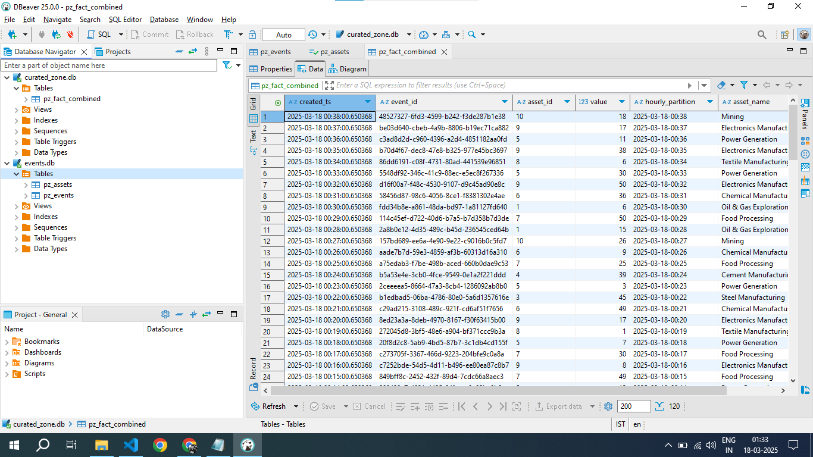

# Dagster Pipeline
A Modern ETL data Pipeline using
- Dagster
- Python
- Pandas
- PyTest
- Automate Lieage and Metadata Tracking

# Architecture

# Project Overview
This project demonstrates a modern ETL (Extract, Transform, Load) data pipeline using Dagster, Python, and Pandas. The pipeline is designed to efficiently process and transform data, making it ready for analysis and reporting. Dagster is used as the orchestration tool to manage the workflow, ensuring that each step of the pipeline is executed in the correct order and handling any dependencies between tasks. Python and Pandas are utilized for data manipulation and transformation, providing powerful tools for cleaning, aggregating, and analyzing data. This project serves as a template for building robust and scalable data pipelines.

# Global Lineage

# Data Model
The ETL framework has been designed to process both fact and dimension data using a madelion architecture.
## Fact Ingestion
Aims to Ingest Fact Data from Various Source System
## Fact Transformation
Keeps Fact data cleansed and transformed for future Processing

## Dimension Ingestion
In order to ingest Dimension Data we have a seperate module called dim_ingestion
## Dimension Transformaton
Likewise, Fact Transformation we have Dimension processing.
## Curation
A curation in a merged Layer between Fact and Dimension Data whcih can be further served for Reporting or application to consume

# Asset Persisted in RDBMS

- database Files are saved Under Data folder

# How to Use this Project
- Clone this repo - git clone https://github.com/dipanjannet/dagster_pipeline.git
- Create a Virtual Environment
- python -m venv dagster_tutorial
- Navigate to that Location : cd dagster_pipeline\dagster_tutorial\Scripts
- Activate the Virtual Environment : .\Activate.ps1
- Install necessary deedency : pip install dagster dagster-webserver pandas pytest

# How to Run this Project | Post Activating Venv
- Navigate to : cd .\data_pipeline\
- Run : dagster dev